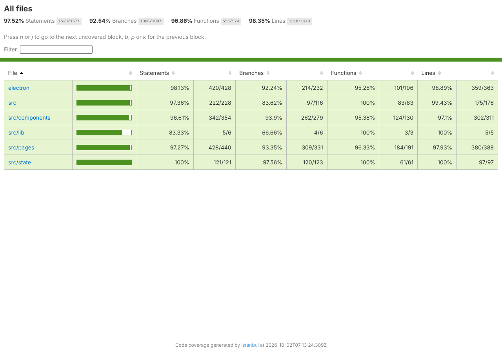

# CareConnect Desktop: Test Report (Week 8)

## How to run

From `desktop-electron/`:

```bash
npm ci
npm test                 # all Jest tests (main + renderer projects)
npm run test:coverage    # Jest with coverage; HTML report in coverage/lcov-report/index.html
npm run test:e2e         # Playwright _electron tests (builds the UI first)
xvfb-run -a npm run test:e2e    # same, on Linux with no display
npm run lint             # ESLint, zero warnings
npm run typecheck        # tsc --noEmit
```

## Results

| Gate | Result |
|---|---|
| `npx tsc --noEmit` | Pass, no errors |
| `npm run lint` | Pass, zero warnings |
| `npx jest --coverage` | 20 suites, 222 tests, all passed |
| `xvfb-run -a npm run test:e2e` | 5 of 5 passed (real Electron) |
| `npm run test:e2e` on an Intel Mac | 5 of 5 passed (real Electron, macOS) |

### Coverage totals

| Metric | Percent | Covered / total |
|---|---|---|
| Statements | 97.61% | 1599 / 1638 |
| Branches | 92.57% | 1073 / 1159 |
| Functions | 97.11% | 572 / 589 |
| Lines | 98.42% | 1372 / 1394 |

The coverage target for the assignment is 75%. `src/types.ts` (type declarations only) is excluded from coverage. The e2e tests run the real Electron app and are not included in the Jest coverage numbers.



### Coverage by file

| File | Stmts | Branch | Funcs | Lines | Uncovered lines |
|---|---|---|---|---|---|
| electron (folder) | 98.15 | 93 | 95.28 | 98.91 | |
| careStore.cjs | 97.56 | 100 | 83.33 | 100 | |
| channels.cjs | 100 | 100 | 100 | 100 | |
| ipc.cjs | 100 | 100 | 100 | 100 | |
| main.cjs | 96.32 | 85.52 | 92.3 | 97.45 | 202-203, 255 |
| menu.cjs | 100 | 96.15 | 100 | 100 | 136 |
| preload.cjs | 95.65 | 83.33 | 91.66 | 100 | 54 |
| security.cjs | 100 | 95.83 | 100 | 100 | 43 |
| tray.cjs | 100 | 100 | 100 | 100 | |
| updater.cjs | 93.75 | 81.81 | 80 | 92.85 | 8 |
| windowState.cjs | 100 | 96.55 | 100 | 100 | 92 |
| src (folder) | 97.45 | 84.16 | 100 | 99.45 | |
| App.tsx | 97.79 | 86.73 | 100 | 99.28 | 35 |
| useFocusTrap.ts | 95.34 | 72.72 | 100 | 100 | 30, 37, 48, 52-62 |
| useTapRipple.ts | 100 | 100 | 100 | 100 | |
| src/components (folder) | 97.12 | 93.2 | 96.37 | 97.32 | |
| AppShell.tsx | 97.12 | 94.34 | 95.72 | 97.35 | 278, 409, 652-654, 1037, 1077, 1295 |
| ConfirmDialog.tsx | 100 | 100 | 100 | 100 | |
| FormField.tsx | 88.88 | 89.47 | 100 | 88.88 | 20 |
| Logo.tsx | 100 | 0 | 100 | 100 | 1 |
| TapButton.tsx | 100 | 60 | 100 | 100 | 11-12 |
| icons.tsx | 100 | 100 | 100 | 100 | |
| src/lib (folder) | 90 | 72.72 | 100 | 100 | |
| buildInfo.ts | 100 | 80 | 100 | 100 | 4 |
| desktop.ts | 83.33 | 66.66 | 100 | 100 | 48, 59 |
| src/pages (folder) | 97.32 | 93.58 | 96.35 | 97.97 | |
| ActivityPage.tsx | 100 | 100 | 100 | 100 | |
| AppointmentsPage.tsx | 98.14 | 100 | 95.65 | 98.03 | 328 |
| DashboardPage.tsx | 96.46 | 94.18 | 96.07 | 97.02 | 572, 606, 647 |
| LandingPage.tsx | 100 | 100 | 100 | 100 | |
| MedicationsPage.tsx | 94.23 | 94.44 | 92 | 95.12 | 161, 240 |
| MessagesPage.tsx | 97.14 | 90.22 | 96.49 | 98.42 | 69, 548 |
| SignInPage.tsx | 100 | 90 | 100 | 100 | 31 |
| SignUpPage.tsx | 100 | 92.85 | 100 | 100 | 34 |
| src/state (folder) | 99.21 | 96.99 | 100 | 100 | |
| careLogic.ts | 99.1 | 96.92 | 100 | 100 | 37-43, 114, 438 |
| seed.ts | 100 | 100 | 100 | 100 | |

## Test inventory by layer

| Layer | Files | Tests | What it covers |
|---|---|---|---|
| Unit: pure logic | `test/renderer/careLogic.test.ts` | 35 | Care plan logic: sign in, medications, appointments, messages, check-in and undo, unread count, import/export parsing |
| Unit: main process modules | `test/main/menu`, `ipc`, `careStore`, `tray`, `security`, `updater`, `preload` | 62 | Menu template and accelerators (including the macOS app menu, About role and Help role), IPC handlers (sender check, validation, errors), atomic store, tray menu, security helpers, updater, preload bridge and channel sync |
| Main process bootstrap | `test/main/main.test.cjs` | 21 | Whole main process against a fake Electron: window options, single instance, session updates, title and badge, menu commands, macOS About panel, menu bar template icon, macOS lifecycle (close hides the window and keeps the session; quit really closes) |
| IPC integration | `test/main/ipc.integration.test.cjs` | 6 | Real preload bridge talking to the real main-process IPC handlers |
| Window management integration | `test/main/windowState.test.cjs` | 12 | Saving and restoring bounds, off-screen correction, maximized state, debounce and close handling |
| Component and workflow | `App`, `appShell`, `pages`, `dashboard`, `messages`, `workflows` under `test/renderer/` | 72 | React Testing Library: every page, dialog, menu, settings, native menu commands, autosave, import and export, keyboard handling, emergency SOS prompt, check-in undo in the Activity log, care recipient menu, toolbar New message |
| Fresh plan per build | `test/renderer/buildReset.test.tsx` | 5 | A care plan saved by a different build (or with no build id) is ignored at startup; one saved by the same build is restored; dev runs always keep data |
| macOS renderer variant | `test/renderer/macPlatform.test.tsx` | 1 | `navigator.platform` set to MacIntel before the app is loaded in an isolated module registry: the sidebar shows the Command symbol and the F1 dialog shows the macOS "Move to the menu bar" row |
| Accessibility (axe) | `test/renderer/accessibility.test.tsx` | 8 | jest-axe on every screen and dialog (landing, sign in, dashboard and pages, settings, shortcuts, emergency, forms) |
| End to end (real Electron) | `test/e2e/desktop.spec.ts` | 5 | Launch and native menu, security flags, sign in and menu navigation, autosave file, relaunch persistence |

Jest totals by project: main process 101 tests, renderer 121 tests, 222 in total (per-file counts: careLogic 35, App 21, main 21, pages 18, ipc 15, appShell 13, careStore 12, windowState 12, menu 12, dashboard 8, messages 8, accessibility 8, preload 7, ipc.integration 6, security 6, tray 5, updater 5, buildReset 5, workflows 4, macPlatform 1).

End-to-end tests (Playwright `_electron`, run under xvfb):

1. Window opens with the landing page and the native menu labels.
2. Security: isolated, sandboxed renderer with a narrow bridge (no `require`, no `process`, only `window.careConnect`).
3. Sign in, the menu becomes enabled, and a menu command reaches the Medications page. Xvfb cannot reliably send real key presses to the native menu, so the test invokes the menu item's `click()` in the main process, which is the same code path the accelerator uses.
4. Autosave writes `care-data.json` to the user data folder.
5. Window bounds and the care plan persist across a relaunch.

## Mapping to the team's earlier test plan themes

| Test plan theme | Where it is tested |
|---|---|
| Sign in | `App.test.tsx` (landing to sign in to dashboard, required field validation), `pages.test.tsx` (sign in, sign up validation), e2e test 3 |
| Dashboard check-in | `dashboard.test.tsx` (check-in recorded and undone, widgets, alerts, customize), `careLogic.test.ts` |
| Medications: add, edit, delete, mark taken | `pages.test.tsx` (add with validation, edit, delete with confirmation, mark taken), `dashboard.test.tsx` (quick toggle), `workflows.test.tsx` |
| Appointments: add, edit, delete | `pages.test.tsx`, `workflows.test.tsx` |
| Activity filter | `pages.test.tsx` (filters entries and refreshes), `workflows.test.tsx` |
| Messages: read, unread, archive, compose, reply, delete | `messages.test.tsx` (read/unread toggles, archive and unarchive, compose with cc/bcc/attachments, reply, delete confirmation, empty inbox) |
| Settings, theme, text size, high contrast | `appShell.test.tsx` (settings dialog), `App.test.tsx` (theme remembered, high contrast toggle) |
| Left-Hand Mode | `appShell.test.tsx`, `App.test.tsx` (View menu toggle) |
| Keyboard shortcuts | `menu.test.cjs` (accelerators), `appShell.test.tsx` (F1, Ctrl+, Ctrl+F, Ctrl+N, zoom, menus operable by keyboard), `App.test.tsx` (Ctrl+number), e2e test 3, `workflows.test.tsx` (focus trap) |
| Persistence | `careStore.test.cjs`, `windowState.test.cjs`, `App.test.tsx` (autosave, load at startup, damaged file), e2e tests 4 and 5 |
| Desktop only: native menu, tray, notifications, file dialogs, security | `menu`, `tray`, `main`, `ipc`, `ipc.integration`, `security` tests, e2e tests 1 and 2 |

## Known gaps

- Real keyboard accelerators and the native tray cannot be exercised under xvfb; they are tested through the menu and tray templates and by invoking menu item handlers.
- The tests run on Linux in the cloud container. The macOS installer, VoiceOver, the macOS menu bar, Dock badge and the Increase contrast setting are checked by hand on an Intel Mac; see [MAC_TEST_CHECKLIST.md](MAC_TEST_CHECKLIST.md) and [ACCESSIBILITY_TESTING.md](ACCESSIBILITY_TESTING.md). Windows (NVDA, contrast themes, installer) is a secondary manual check.
- The macOS app folder was assembled from Linux with `electron-builder --mac dir --x64` to validate the packaging config. The `.dmg` itself needs a Mac or the GitHub macOS runners.
- The e2e tests are written to run on macOS too (the menu helper accepts "Settings…"); CI runs them on the macOS runners before packaging.
- Uncovered lines are mostly defensive branches (listed in the table above).
